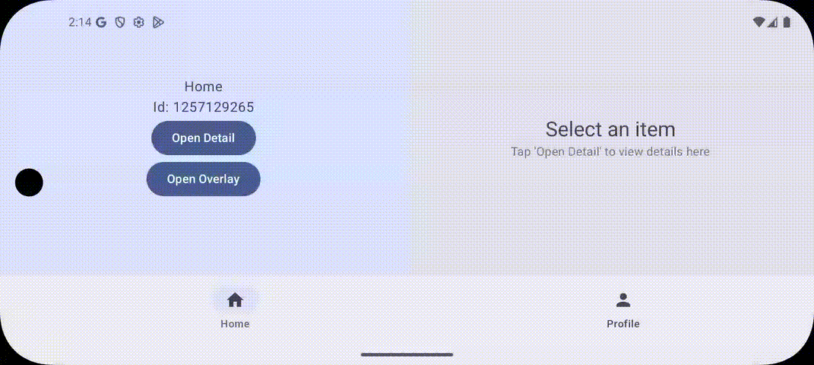

# Navigation3 Exploration

An Android app exploring the **Navigation3** library's advanced navigation patterns and adaptive UI
strategies.

## Features

This project showcases more complex layouts that can be built with `Navigation 3`. Mainly built to
showcase how to share components across scenes (e.g. a `BottomBar`) and not having to declare it
globally. It uses two strategies `AdaptiveTwoPaneStrategy` and `OverlaySceneStrategy`.

### **ListDetailSceneStrategy**
- Inspired by [adaptive-navigation3](https://android.googlesource.com/platform/frameworks/support/+/refs/heads/androidx-main/compose/material3/adaptive/adaptive-navigation3/src/androidMain/kotlin/androidx/compose/material3/adaptive/navigation3)
- Automatically switches between single-pane and two-pane layouts based on screen size
- Displays bottom navigation bar when needed (stretches over two pane if one of both panes requires
  it)
- Shows placeholder content (if needed) on larger screens if only 1 pane is present.

### **OverlaySceneStrategy**

- Displays overlay content as dialogs on tablets
- Shows content as bottom sheets on mobile devices

### **TopLevelBackStack**
[nav3-recipes](../../../android/nav3-recipes)
- Inspired
  by [@kotlearn's jetpack-navigation-3-alpha](https://github.com/kotlearn/jetpack-navigation-3-alpha)
- Maintains separate navigation stacks for each top-level destination (Home, Profile)
- Preserves navigation state across configuration changes (due to custom saver)

## Tech Stack

- **Navigation3** (alpha) - Next-generation Android navigation
- **Jetpack Compose** - Modern Android UI toolkit
- **Material3** - Latest Material Design components
- **Adaptive UI** - Responsive layouts for different screen sizes

## Demo

### Two-Pane Layout (Tablet)

### Single-Pane Layout (Mobile)

